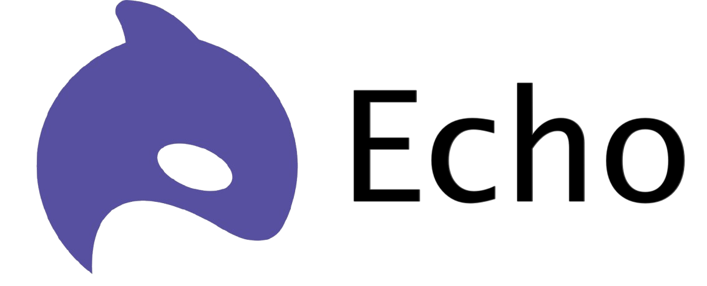

<h1 align="center">
  <picture>
    <!-- Dark mode logo -->
    <source 
      srcset="logoTextDark.png" 
      media="(prefers-color-scheme: dark)"
      width="300" 
      height="130"
    >
    <!-- Light mode logo -->
    
  </picture>
</h1>

# What is Echo?

Echo is a secure chat app with a security protocol based on the [**Signal Protocol**](https://signal.org/docs/). Built with minimal external library use, all **Diffie Hellman Operations** including **Scalar Multiplication** are powered by our own Rust modules compiled with **WebAssembly** for the WebApp.

